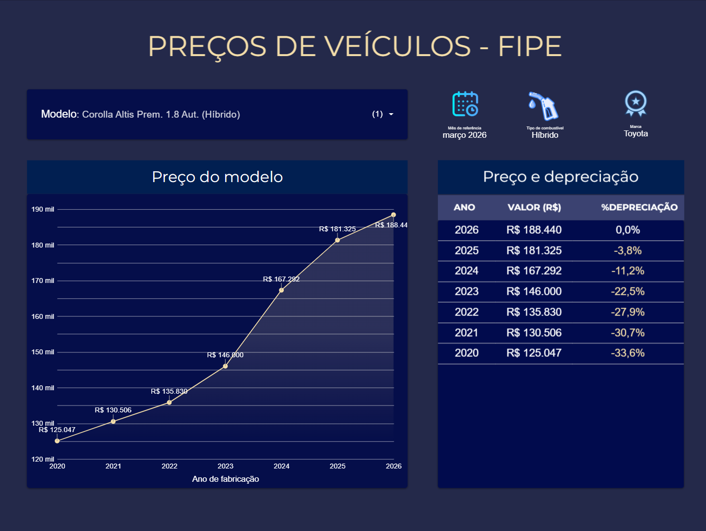
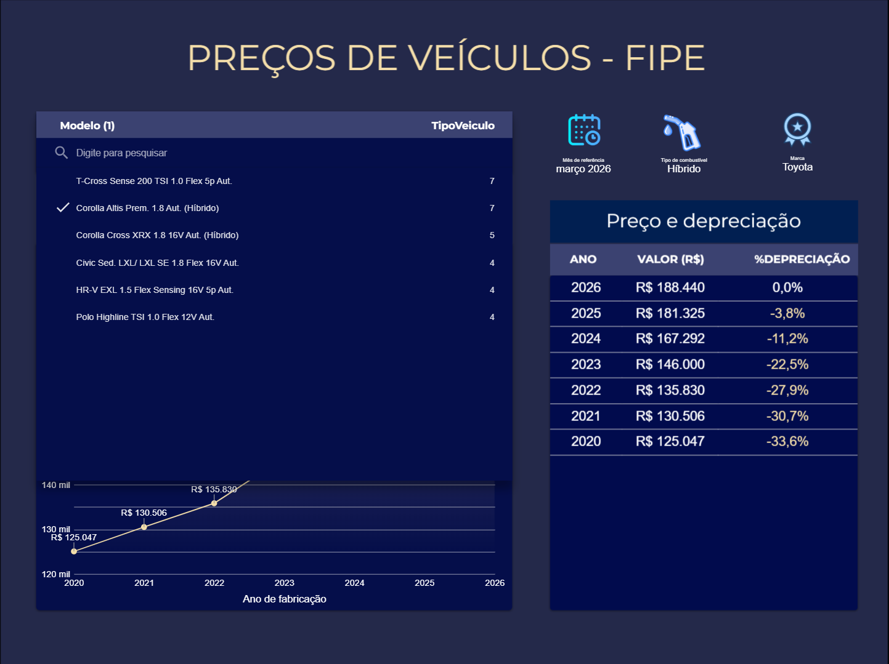
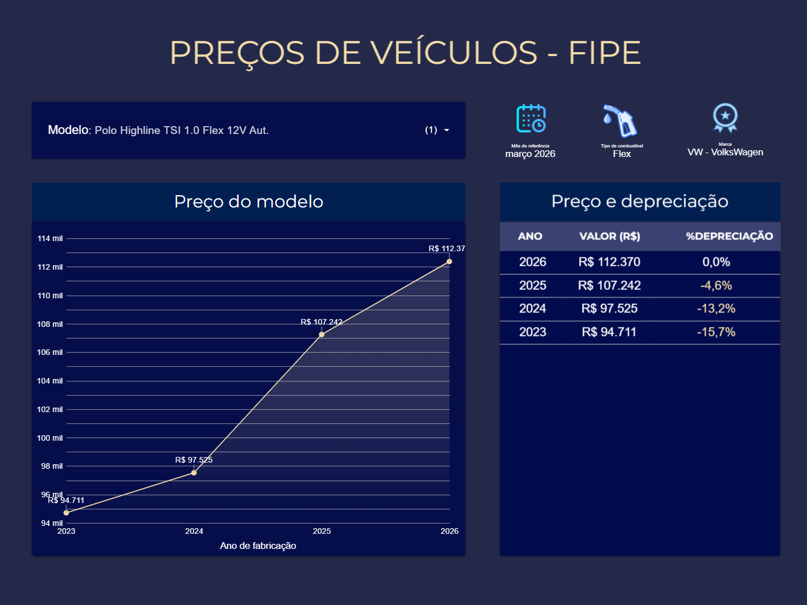
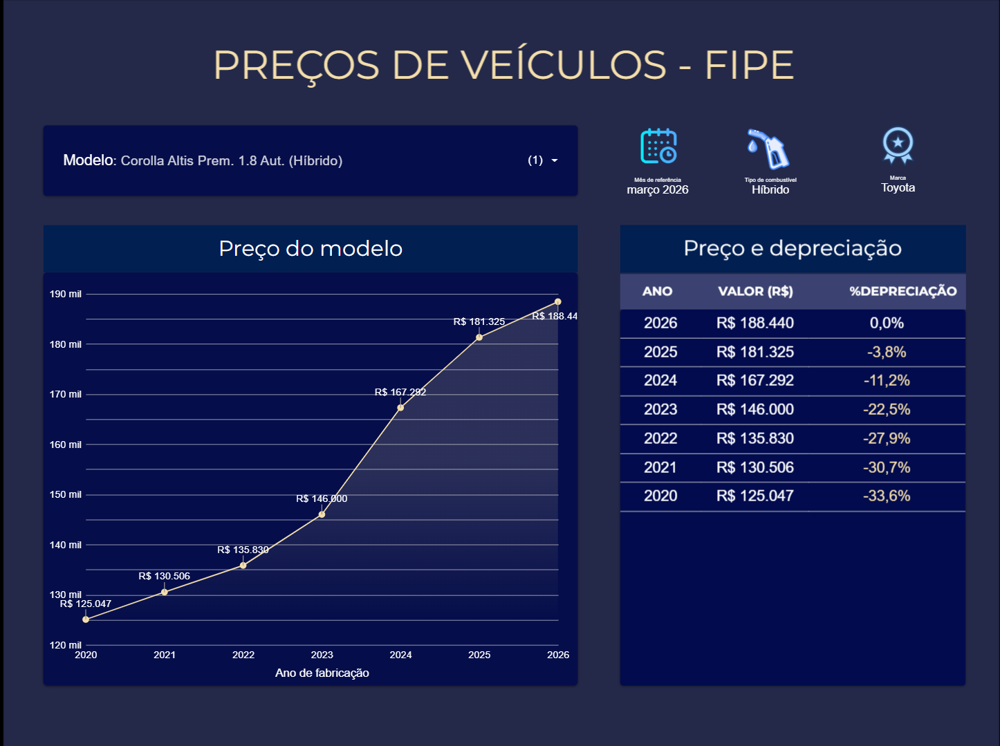

🚗 FIPE Data Pipeline & Analytics Dashboard
Este projeto consiste em um pipeline de dados automatizado que extrai dados históricos da API FIPE (https://parallelum.com.br/fipe/api/v1), processa as informações via Python e as carrega no Google BigQuery para visualização avançada no Looker Studio.

O objetivo principal é fornecer uma análise de Depreciação Veicular em tempo real.

🚀 Funcionalidades
Extração Automatizada: Script Python que consulta a API FIPE para modelos específicos (ex: Corolla, Polo, T-Cross).

Pipeline CI/CD: Automação total via GitHub Actions, programada para atualizar os dados mensalmente.

Data Warehouse: Armazenamento estruturado no Google BigQuery com tratamento de tipos (Dates, Floats).

BI Dashboard: Interface Dark Mode no Looker Studio com cálculos analíticos de depreciação acumulada.

🛠️ Tecnologias Utilizadas
Linguagem: Python 3.x

Bibliotecas: requests, pandas, google-cloud-bigquery

Cloud: Google Cloud Platform (BigQuery)

Orquestração: GitHub Actions

Visualização: Looker Studio

📊 O Dashboard
O dashboard foi projetado sob a estética Dark, focando em KPIs críticos para tomada de decisão:

Curva de Valorização: Gráfico de série temporal mostrando a evolução do preço.

Tabela de Depreciação: Cálculo analítico comparando cada ano contra o modelo zero quilômetro (2026).

## 📊 Visualização do Projeto

🔧 Configuração do Repositório
Variáveis de Ambiente (Secrets)
Para rodar este projeto, você precisará configurar as seguintes Secrets no seu repositório:

GCP_PROJECT_ID: ID do seu projeto no Google Cloud.

GCP_SERVICE_ACCOUNT_KEY: Chave JSON da conta de serviço com permissão de escrita no BigQuery.

Como Executar Localmente
Bash
# Instale as dependências
pip install -r requirements.txt

# Execute o script de carga
python load_data.py

📊 Cobertura de Dados e Escopo
Status do Escopo: Monitoramento de Modelos Selecionados.

Atualmente, o pipeline está configurado para extrair e processar dados históricos de modelos específicos que representam diferentes categorias de mercado (Híbridos, Sedans e SUVs). Esta seleção permite uma análise de depreciação mais precisa e controlada.

Modelos Monitorados:
Toyota: Corolla Altis Premium 1.8 Aut. (Híbrido) e Corolla Cross XRX 1.8 16V Aut. (Híbrido).

Volkswagen: T-Cross Sense 200 TSI 1.0 Flex Aut. e Polo Highline TSI 1.0 Flex 12V Aut..

Honda: Civic Sed. LXL/ LXL SE 1.8 Flex 16V Aut. e HR-V EXL 1.5 Flex Sensing 16V 5p Aut..

Granularidade Temporal:
Histórico: Dados extraídos para os anos de fabricação entre 2020 e 2026.

Referência: Última atualização baseada na tabela de março de 2026.

💡 Dica para o README:
Se você quiser mostrar que o projeto é escalável, adicione logo abaixo desta seção:

"Como adicionar novos modelos?"
"Para expandir o monitoramento, basta incluir o código FIPE da marca e do modelo desejado no arquivo de configuração do pipeline. O sistema GitHub Actions detectará as novas entradas e atualizará o BigQuery automaticamente na próxima execução."

📈 Roadmap de Evolução
[ ] Containerização: Implementar Docker para garantir a portabilidade total do pipeline.

[ ] Implementar comparação direta entre dois modelos (ex: Corolla vs Civic).

[ ] Adicionar mais modelos de veículos

Desenvolvido por W. Mota | 2026
